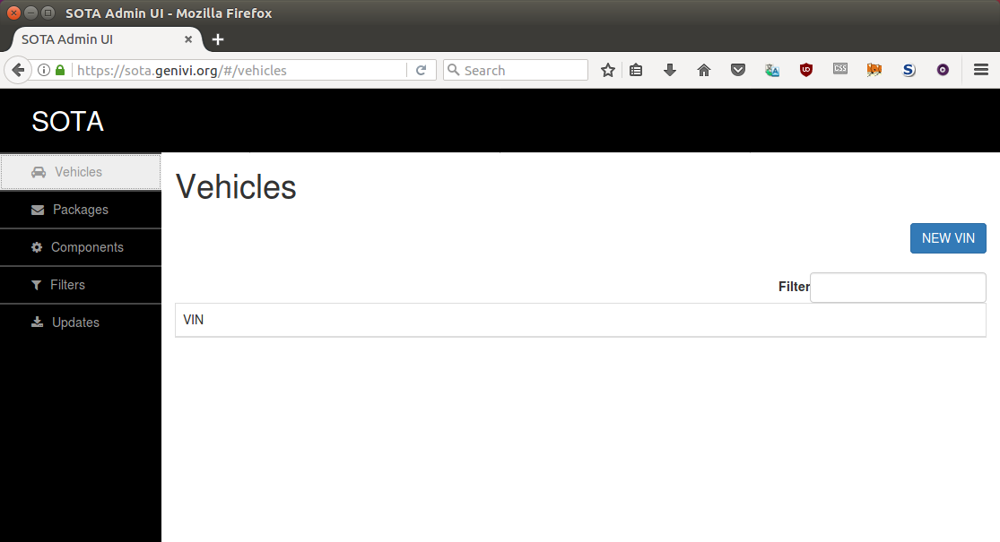
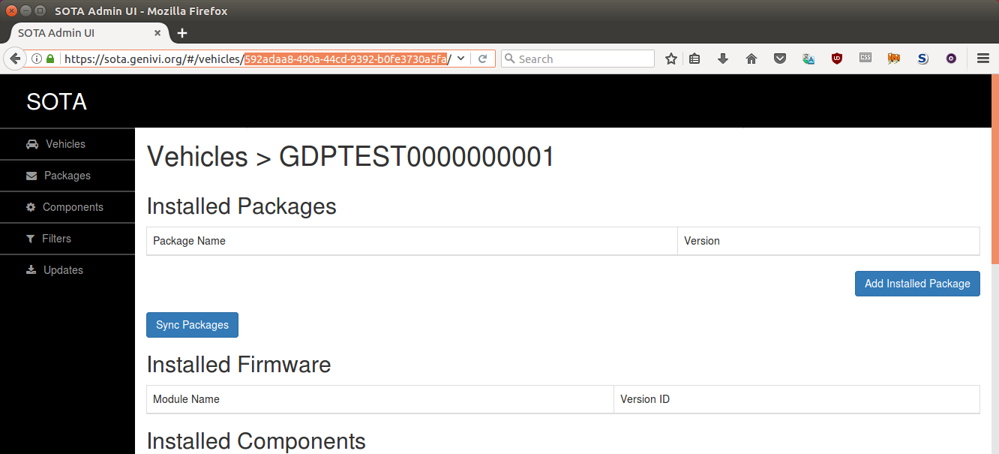
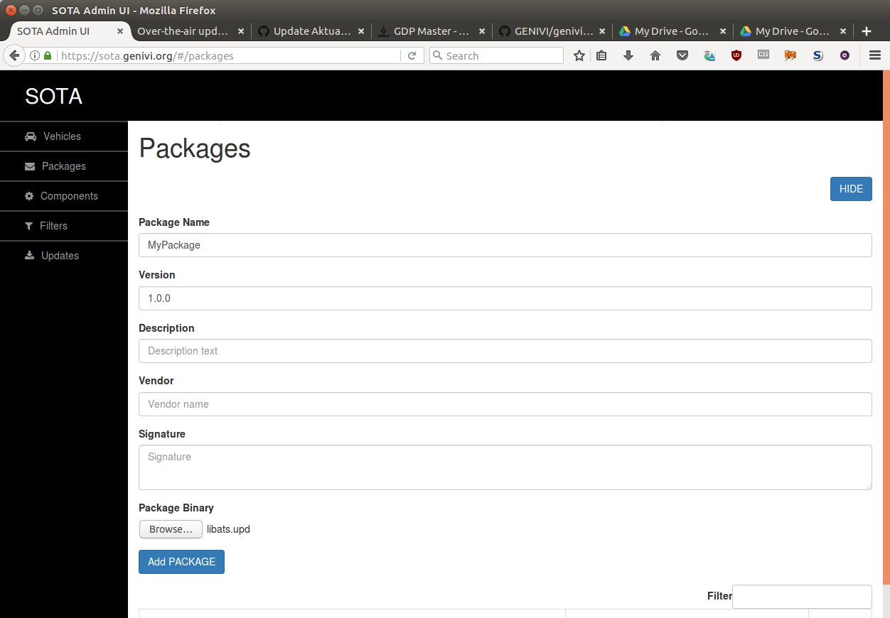
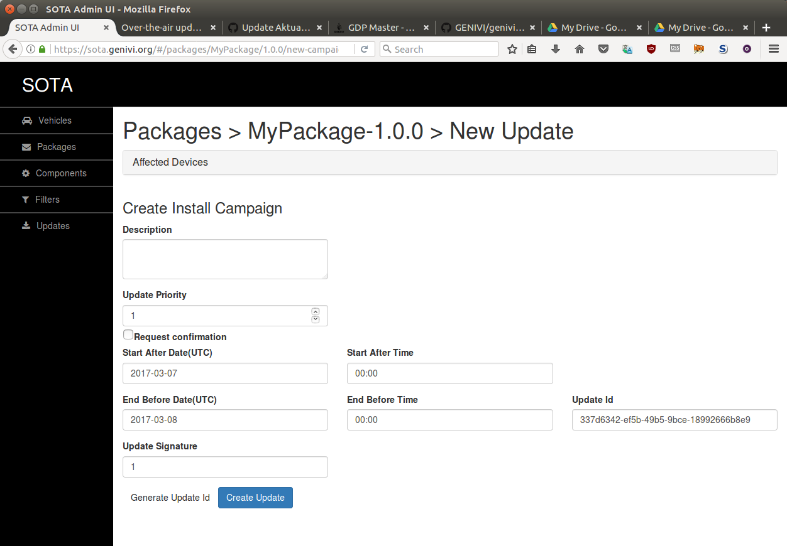

= Over-the-air updates on the DENIVI Demo Platform
:icons: font
:toc: left
:data-uri:

== History

GENIVI started developing an over-the-air update solution in mid-2015, commissioning link:https://advancedtelematic.com[ATS] to develop a server and client solution with the GENIVI Demo Platform and automotive applications in mind. It was designed to communicate over https://github.com/GENIVI/rvi_core[RVI] and integrate with the https://github.com/GENIVI/genivi_swm[GENIVI Software Management] architecture for installing updates to ECUs throughout the vehicle.

Since then, the server has been put into production in configurations without RVI, and clients are operational installing updates via methods other than the GENIVI Software Management architecture. Two different client implementations are now available, with Yocto recipes for each. Supported by a GDP Challenge grant, link:https://advancedtelematic.com[ATS Advanced Telematic Solutions] is implementing for the first time an end-to-end solution for GENIVI incorporating the RVI SOTA Server, RVI Core, GENIVI Software Management, LDAP user authentication, and the SOTA Client.

This new solution is available at https://sota.genivi.org[sota.genivi.org] to all GENIVI members, ready to use with the latest Yocto recipes for GDP.

== Client Quickstart

*Prerequisites:*

. An account at https://sota.genivi.org[sota.genivi.org]. (Contact GENIVI IT Support to request an account.)
. The ability to build the GENIVI Development Platform. (See the GDP building docs from the link:https://github.com/genivi/genivi-dev-platform/[genivi-dev-platform README].)

=== Create a new Vehicle

Automatic device registration is not yet supported by sota.genivi.org, so you'll need to create a device in your account before connecting that device for updates.

On the vehicles tab, click *NEW VIN*.

TIP: Vehicle/device identifiers don't actually need to be conformant VINs. You can name your devices whatever you want.

Once you've created a vehicle, click on it to go to that vehicle's page. Get the device UUID from the address bar, highlighted here:

You'll need this once you boot the vehicle/device for the first time.

=== Build GDP with SOTA support

The GENIVI SOTA Server communicates over RVI, and so the device image you build needs to be configured to talk to the RVI node at the GENIVI SOTA Server. Checkout the `gdp-integration` branch from link:https://github.com/advancedtelematic/meta-genivi-dev[ATS's fork of the meta-genivi-dev repo] for up-to-date recipes, and build and flash your device as normal.

To start from scratch, you'd do something like this:

----
git clone --recursive https://github.com/genivi/genivi-dev-platform/
cd genivi-dev-platform/meta-genivi-dev
git remote add ats https://github.com/advancedtelematic/meta-genivi-dev
git fetch ats
git checkout gdp-integration
cd ..
source init.sh PLATFORM # where PLATFORM is a valid GDP target architecture
bitbake genivi-dev-platform
----

.Optional: Bake in vehicle configuration
****
It's possible to add individual device configuration during the Yocto build process. This isn't the default, since we would normally expect a Yocto-built system image to be suitable to install on multiple different devices. However, if you wish, you can edit the default config files before you build. They're located in `/meta-genivi-dev/meta-genivi-dev/recipes-sota/rvi-sample-config/rvi-sample-config`. Edit both `sota.toml` and `conf.json`, changing the default device UUID to the one you created in the first step.
****

=== Configure your vehicle for updates

If you chose to bake in your config when you built the image, you can skip this step.

On your device, edit `/etc/sota.toml` and `/etc/rvi/conf.json`. Find the `uuid = "XXXX"` line, and put in the UUID you just created. Then, restart the client, either by rebooting the device or with `systemctl restart aktualizr`. You could also edit the files by mounting the boot media before booting the system.

=== Upload a package

To upload a package, go to the Packages tab at sota.genivi.org and upload a new package in GENIVI SWM format. The *Name* and *Version* fields are required; the others are optional.

=== Create a Campaign

To send this new package to your vehicle, click *Create Campaign*, in the right-hand column of the list of packages on the Packages tab. The *Description* field is optional; all others are mandatory. For the update ID, you can click the button to generate a random one.

The update will start, and a notification will be sent through RVI to the SOTA client on the vehicle. The update will download, and be passed off to the GENIVI SWM for installation.

=== Other features

The GENIVI SOTA Server also supports creating filters that determine what subset of vehicles should receive a particular package. (If no filters are defined for a package, it will be sent to all vehicles.) For more details on the filter syntax, please consult the link:http://advancedtelematic.github.io/rvi_sota_server/doc/admin-gui-user-guide.html[Admin GUI documentation] for the rvi_sota_server project.

